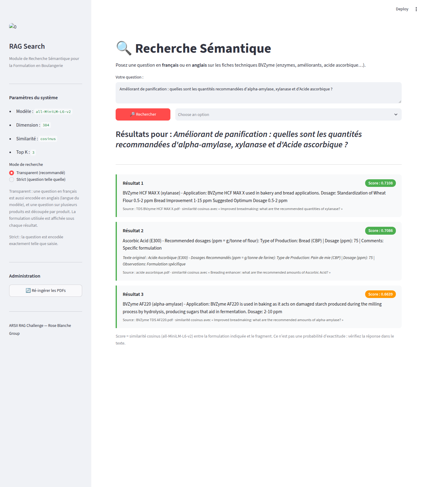
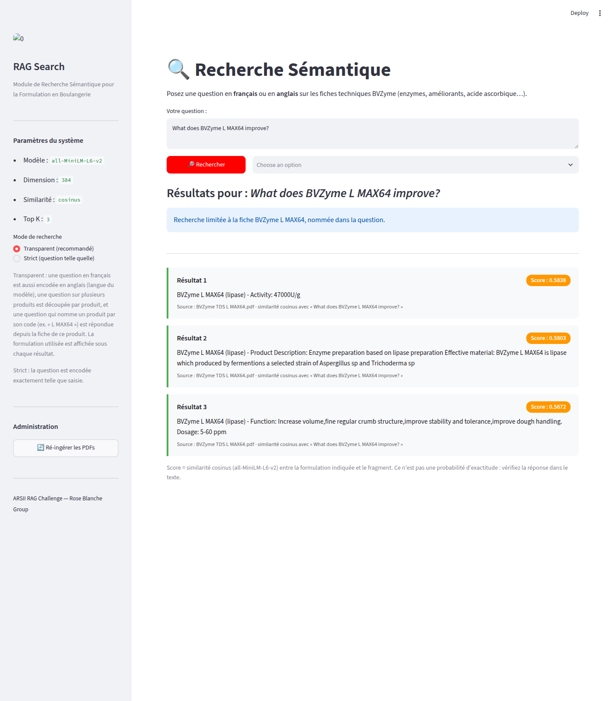

# Getting the most right answers inside the challenge's rules

This follows [AUDIT.md](AUDIT.md), which showed that the previous system's scores were inflated. The question here is different: **how many right answers can this RAG give while respecting the brief, without inventing anything?** The app on this branch now runs the resulting pipeline.

## Short answer

Measured on **TEST-3**, a fresh set of 62 questions frozen before the final configuration was chosen and run once:

| system | right answer in the top 3 | right answer ranked 1st | French questions | multi-product questions: share of products covered |
|---|---:|---:|---:|---:|
| original system (as submitted) | 33/52 = 0.63 | 0.52 | 0.61 | 0.43 |
| basic honest pipeline (sections, strict) | 33/52 = 0.63 | 0.52 | 0.61 | 0.43 |
| **this pipeline, strict mode** | **42/52 = 0.81** | 0.67 | 0.79 | 0.50 |
| **this pipeline, transparent mode** | **48/52 = 0.92** | **0.85** | **0.97** | **0.86** |

- **Strict mode** embeds the question exactly as typed, which is the literal reading of the brief. It beats the original system on paired questions: 12 vs 3, exact McNemar p = 0.035.
- **Transparent mode** also embeds a French question in English and splits a multi-product question per product. It shows which formulation produced each score. Against the original system: 16 vs 1, p = 0.0003.

Both modes use the imposed `all-MiniLM-L6-v2`, cosine similarity and top 3. Every stored fragment is text from the PDFs or a guarded translation of it, and every displayed score is the true cosine between the displayed fragment and the displayed formulation of the question.

**This corrects my earlier conclusion.** In AUDIT.md §4.5 I wrote that, under strict terms, chunking had no significant headroom left. That was based on four variants and was too pessimistic. The fragment design below raises strict-mode right answers from 33 to 42 out of 52 on a fresh held-out set (p = 0.004).

**Product-code filter, added afterwards.** In transparent mode, a question that names a product by its code ("L MAX64", "lmax64", "L-MAX 64") is now answered from that product's sheet, still ranked by cosine. The failures of TEST-2 and TEST-3 suggested it ([ERROR_ANALYSIS.md](ERROR_ANALYSIS.md)), so neither set can measure it. It was measured once on **TEST-4**: 77 fresh questions that all name a product, frozen before the filter was written.

| transparent mode on TEST-4 | without the filter | with the filter |
|---|---:|---:|
| single-product questions: right answer in the top 3 | 53/60 | 56/60 |
| questions naming two products, or a product and another family: everything named is covered | 5/14 | 12/14 |

- On single-product questions it fixed 3 and broke none. That is too few to rule out luck (exact McNemar p = 0.25).
- On questions naming several things, 8 were gained and 1 was lost (p = 0.039).
- The TEST-3 table above is the system before the filter.
- On these product questions, strict mode (42/60) does no better than the original system (43/60).

## 1. The challenge's state space

| | what | how it is handled |
|---|---|---|
| **Fixed by the brief** | question embedded with `all-MiniLM-L6-v2`; cosine similarity with the stored embeddings; results ranked by score; top 3; fragment text and score displayed; table `embeddings(id, id_document, texte_fragment, vecteur VECTOR(384))` | respected in both modes |
| **Free** | how the PDFs become fragments; which fragments exist; how duplicate content is handled; what else the UI shows | used to the maximum, without adding facts (§2) |
| **Depends on interpretation** | whether the question may be preprocessed before it is embedded (translated, split per product), and whether the search may be restricted to the sheet of a product the question names | offered as a switch: `SEARCH_MODE=strict` or `transparent` (default), with the formulation shown next to each score and any restriction shown above the results |
| **Not used** | another embedding model, fine-tuning, re-ranking by another model, keyword scores mixed into the ranking, question-like or keyword-stuffed text in the corpus, a displayed score that is not the cosine of what is shown | outside the rules or not honest |

The product filter is not keyword search fusion. It only decides which sheet is searched, from a product code the question names. The ranking inside that sheet is the cosine alone.

## 2. What changed, and what each part is worth

Each change fixes a failure pattern found by reading wrong answers. Each one is content-preserving: it reorganizes or faithfully translates what the PDFs say.

| change | failure it fixes |
|---|---|
| clean extraction (`x_tolerance=1.5`), letterhead removed from sections, Unicode normalized | AF SX's text had no spaces at all; the company address diluted every fragment |
| section fragments headed by product and enzyme, both read from the same PDF | a fragment must say which product it is about |
| words split by the PDF re-joined, only when the joined form is a known word (15 repairs, all checked) | "Amyloglu cosidase", "applicatio ns", "rang e", "pp m" |
| Product Description merged into Effective material | "Enzyme preparation based on X" alone only repeats the header, so it matched every question about X |
| Application+Dosage and Function+Dosage groupings (neighboring sections) | "Dosage: 5-40 ppm" alone is too short to be found; "how much X to strengthen dough" landed on the Function text without the dose |
| page-1 product card | an overview fragment for general questions about one product |
| French tables kept whole **and** one fragment per row (row + column headings) | "frozen dough" must find the *Surgélation* row (150–200 ppm), not the whole table |
| French document also indexed in English, translated sentence by sentence with product names masked, glossary labels and number/length guards (1 of 34 translations rejected and left untranslated) | the model only understands English well; English questions about the French sheet failed |
| letterhead kept as its own fragment, without a product header; update date kept with the Storage block it ends | "who makes BVZyme?" and "when were the sheets updated?" are in the PDFs |
| a fragment whose content is already shown is skipped (a translation, or a section inside a card already shown) | the 3 slots should hold 3 different pieces of information |
| **transparent mode**: French question also embedded in English (OPUS-MT), best of the two kept | "Les produits sont-ils irradiés ?" has a cosine of 0.16 with the right English fragment |
| **transparent mode**: one sub-question per product family named, keeping the user's wording; best fragment *about that product* for each | one vector cannot cover "alpha-amylase, xylanase and ascorbic acid" |
| **transparent mode** (added after TEST-3): a question naming a product by its code, however it is cased, spaced or hyphenated, is answered from that product's sheet; several products or families named get one sub-question each | the model misreads codes: "L MAX64" found TG MAX64's text, "How much A SOFT305…" found three lipase sheets |

What each part is worth: every row removes one part from the final system, measured on TEST-3. This is analysis only; nothing was chosen from it.

| configuration | strict: right in top 3 | transparent: right in top 3 | transparent: multi-product coverage |
|---|---:|---:|---:|
| final | **42/52** | **48/52** | **0.86** |
| − French document indexed in English | 40 | 43 | 0.86 |
| − Application/Function+Dosage groupings | 40 | 47 | 0.86 |
| − table rows | 39 | 47 | 0.86 |
| − Product Description merged | 41 | 47 | 0.79 |
| − letterhead fragment | 41 | 47 | 0.86 |
| − product cards | 42 | 48 | 0.86 |
| − split-word repair | 42 | 48 | 0.86 |
| transparent without question translation | – | 42 | 0.64 |
| transparent without per-product split | – | 48 | 0.57 |
| sections only (audit baseline) | 33 | 35 | 0.79 |

No single part is decisive: they add up. Cards and split-word repair make no difference on this set, but they cost nothing and keep all PDF content reachable.

## 3. How it was measured

The risk in tuning a system is fooling yourself: every look at a test set's failures makes that set a little less of a test. So each configuration was measured on a set frozen in git **before** it was chosen, and each set was run once:

| step | development questions | held-out set, frozen at | result on it |
|---|---|---|---|
| audit (AUDIT.md) | – | TEST, `9e0c3e4` | pre-registered baselines |
| configuration v1 | DEV + TEST (73) | TEST-2 (85 questions), `9cb134a` | v1 strict 40/70, transparent 54/70; original system 43/70 |
| configuration v2 = fixes suggested by TEST-2 failures | DEV + TEST + TEST-2 (158) | TEST-3 (62 questions), `b6e31ab` | table above |
| product-code filter = fix suggested by TEST-2 and TEST-3 failures | DEV + TEST + TEST-2 + TEST-3 (220) | TEST-4 (77 questions, all naming a product), `9ef1b1d` | transparent 53 → 56/60; several things named, all covered: 5 → 12/14 |

- **Questions.** TEST-2, TEST-3 and TEST-4 were not hand-picked. What to ask (product or family, attribute, French or English) was drawn at random with a fixed seed ([`sample_test2_slots.py`](sample_test2_slots.py), [`sample_test3_slots.py`](sample_test3_slots.py), [`sample_test4_slots.py`](sample_test4_slots.py)), and I wrote a natural question for each draw. For TEST-4, how the code is written was drawn too. Unanswerable questions were added by hand.
- **Relevance.** A result counts only if it comes from the right PDF and contains the actual answer, for example that product's real dosage range ([`eval_set.py`](eval_set.py)).
- **Numbers.** Full tables with confidence intervals and paired tests are in [`results/test2.md`](results/test2.md), [`results/test3.md`](results/test3.md) and [`results/test4.md`](results/test4.md). TEST-3 turned out easier than TEST-2 for every system; the ranking of the systems is the same on both.
- **The app is the measured system.** Ingesting the PDFs with the app gives the same 609 fragments as the experiment code. The app's pgvector search returns the same top 3 and scores for all 297 evaluation questions in both modes, product filter included (0 mismatches).

## 4. What is still out of reach inside the rules

- **Quantity questions.** The imposed model links "how much … per tonne" to *activity* units ("10000 U/g") as readily as to *Dosage*. Some dose questions still miss.
- **Machine translation quirks.** "conditionnement" → "conditioning", "pâte" → "paste", "malte" → "Malta", "Dosage du …" → "Determination of …". The original is always shown next to a translation, but a bad query translation can still miss.
- **A product code must be written in full.** "L MAX64", "lmax64" and "L-MAX 64" all restrict the search to that sheet. A partial code ("MAX64" could be L, TG or HCF MAX64) or a typo does not, and the question is answered as before. A question naming a product and asking about others ("AF110 compared with other alpha-amylases") is answered from AF110's sheet only.
- **Inside the right sheet, the model can still miss the section.** "Limite en plomb" ranks Dosage first, and no sheet says who the "manufacturer" is.
- **Strict mode cannot cover several products with one vector.** Multi-product coverage is 0.50 strict vs 0.86 transparent.
- **Scores do not tell you when there is no answer.** Unanswerable questions got top scores of 0.44–0.73, inside the range of answerable ones (medians 0.61–0.66). The UI says so under the results.
- **Near-identical products.** For a family-level question, three of nine sibling products are shown and the choice among them is essentially arbitrary. Their dosages differ, so read the product name.

**Extraction and chunking were compared exhaustively afterwards** ([ROUTES.md](ROUTES.md)): 14 extractors and 10 chunking routes, confirmed on a fresh set (TEST-5).
- The current choices are tied for best.
- Chunking that ignores the sheets' structure loses answers, and putting every possible fragment in the index loses 35 of 281.

The biggest remaining lever is outside the rules. With the same fragments, a retrieval-trained multilingual 384-d model (`multilingual-e5-small`) fixes most French failures in strict mode (AUDIT.md §4.6). That is worth raising with the organizers.

## 5. Using it

```bash
python main.py            # 1 = ingest the PDFs, 2 = search, 4 = switch strict / transparent
streamlit run app.py      # mode switch in the sidebar
SEARCH_MODE=strict python main.py
```

For each result the app shows the fragment, its score, the source PDF, the formulation of the question that produced the score and, for a translated fragment, the original French text. When the search was restricted to sheets the question names, a notice above the results says so.





Reproduce the measurements with `python -m audit.evaluate_heldout --set test4` (and `--set test3`, `--set test2`). [ERROR_ANALYSIS.md](ERROR_ANALYSIS.md) checks these results by hand and explains every remaining error. The original pipeline is kept verbatim in [`legacy/`](legacy/), writing to its own `legacy_embeddings` table, so the audit stays reproducible.
